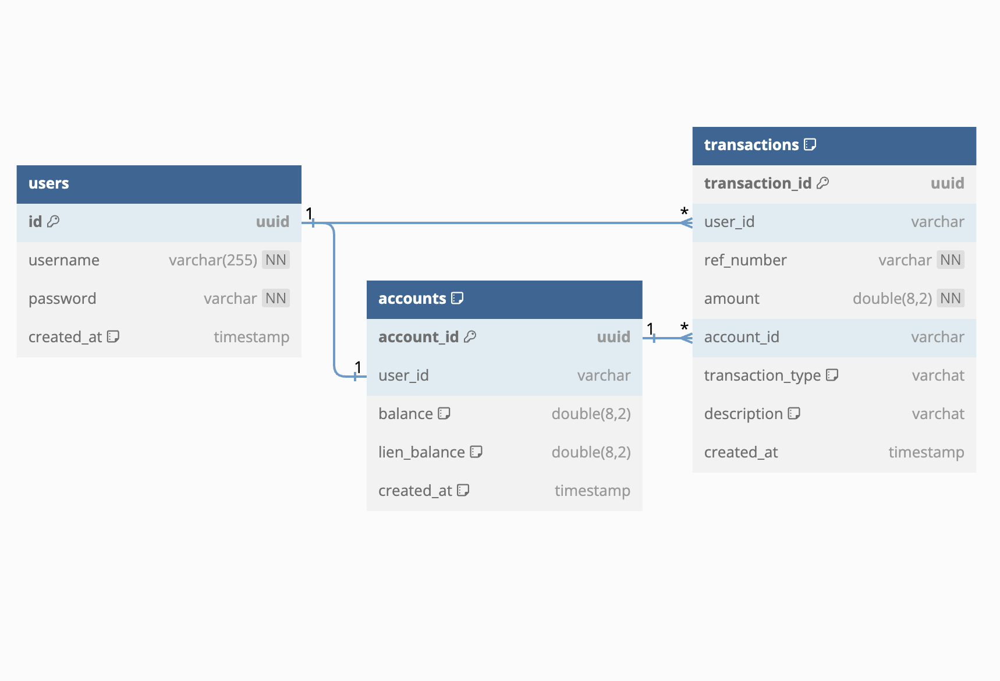

# Demo Credit Wallet Service

**Demo Credit Wallet Service** is a simple Node.js API with TypeScript for managing user wallets. It allows users to create accounts, fund their wallets, transfer funds to other users, and withdraw funds.

## Author 🚀

> OLAORE OLUWAFUNMIBI OLUMUYIWA

## Table of Contents

- [Getting Started](#getting-started)
  - [Prerequisites](#prerequisites)
  - [Installation](#installation)
- [Usage](#usage)
  - [Creating an Account](#creating-an-account)
  - [Funding Your Wallet](#funding-your-wallet)
  - [Transferring Funds](#transferring-funds)
  - [Withdrawing Funds](#withdrawing-funds)
- [Testing](#testing)
- [Docker](#docker)
- [Recommendation](#recommendation)
- [Contributing](#contributing)

## Getting Started

### Prerequisites

Before you start, ensure you have the following installed on your system:

- Node.js
- npm (Node Package Manager)
- MySQL (Make sure you have a MySQL server running)

### Installation

## Install NodeJS

To Install NodeJS, kindly go to [Nodejs](https://nodejs.com) and follow the necessary instructions required depending on
your PC Operating System

## MACOS

using a [package](https://nodejs.org/en/#download) simply download the installer

using [homebrew](https://github.com/Homebrew/legacy-homebrew)

```markdown
brew install node
```

---

## Windows

using a [package](https://nodejs.org/en/#download) simply download the installer

using [chocolatey](http://chocolatey.org/) to install Node

```markdown
cinst nodejs
```

---

## To install MySql

For Windows users, you can kindly follow this
tutorials [here](https://dev.mysql.com/doc/refman/8.0/en/windows-installation.html) to install MySql on
your local PC which explains how to create a database

For Mac users, you can kindly follow this tutorials [here](https://dev.mysql.com/doc/refman/8.0/en/macos-installation.html) to
install MySql on your local PC which explains how to create a database

1. Clone the repository:

   ```bash
   git clone https://github.com/fxmbx/lendsql-be-project.git
   ```

2. Navigate to the project directory:

   ```bash
   cd lendsql-be-project
   ```

3. Install the project dependencies:

   ```bash
   npm install
   ```

4. Configure the database connection by editing the `knexfile.ts` file and providing your MySQL database credentials:

   ```typescript
   connection: {
    host: '127.0.0.1',
    user: 'root',
    password: 'root',
    database: 'demo_credit',
   },
   ```

   and that in the app module

5. Create the necessary database tables by running migrations:

   ```bash
   npm run migrate
   ```

6. Start the server:

   ```bash
   npm run start
   ```

## Review



Your wallet service API should now be running at `http://localhost:8080/v1`.
Swagger on `http://localhost:8080/api` `https://oluwafunmibi-olaore-lendsqr-be-test.onrender.com/api/api`

## Usage

### Redister an User

To create a user, send a POST request to `/users/register` with the following JSON body:

```json
{
  "username": "string",
  "password": "string"
}
```

### Login an User

To login, send a POST request to `/users/login` with the following JSON body:

```json
{
  "username": "string",
  "password": "string"
}
```

### Creating an Account

To create an account, send a POST request to `/account/create` with the following a bearer token header

### Get Account Detail

To get a users account, send a GET request to `/account` with the following a bearer token header

### Get Account Transactions

To create an account, send a GET request to `/account/transactions` with the following a parama

```bash
accountId*: string
userId*: string
```

### Funding Your Wallet

You can fund your wallet by sending a POST request to `/api/wallets/fund` with the following JSON body:

```json
{
  "accountId": "string",
  "amount": 0
}
```

### Transferring Funds

To transfer funds to another user's account, send a POST request to `/account/transfer` with the following JSON body:

```json
{
  "fromAccountId": "string",
  "toAccountId": "string",
  "amount": 0
}
```

### Withdrawing Funds

You can withdraw funds from your wallet by sending a POST request to `/account/withdraw` with the following JSON body:

```json
{
  "fromAccountId": "string",
  "amount": 0
}
```

## Testing

To run unit tests for the project, use the following command:

```bash
npm run test
```

## Docker

To run a docker image of Postgres and RabbitMQ

```bash
docker-compose up
```

## Recommendation

- implements a more secure authentication service
- integrate a payment gateway e.g stripe
- write more tigorous test

## Contributing

Contributions to this project are welcome. If you find any issues or have suggestions for improvements, please open an
issue or submit a pull request.
